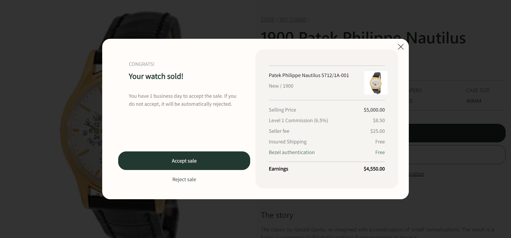

 - Assignment Name: Bezel Challenge: E-commerce Model

 - Assignment Tech Stack: React (Hooks), Tailwind CSS, Javascript/HTML/CSS

 - Description: An e-commerce model with accept and reject sale features. Iteract with API endpoints to fetch product information and post user responses. The main code can be found at src/App.js




 - How to run: At the project's root folder, use the command:
 ```
npm start
 ```